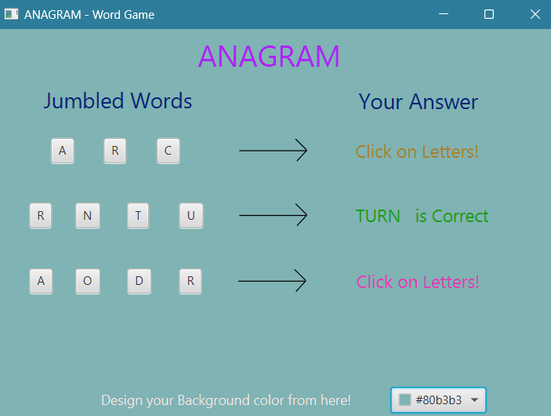

## Overview
These are simple word guessing game and calculator built using JavaFX and Scene Builder. The word guessing game presents the user with a set of jumbled words, and the user has to correctly guess the order of the letters to form the correct word. If the user selects the letters in the correct order, they win the game. If a wrong letter is selected, the game resets. Likewise, simple calculator is a online clone version of Casio WD-320MT desk(ergonomic calculator, that can calculate upto 1e18 ranged numbers with a precision of 1e-6.) 

## Features
- Interactive graphical user interface using JavaFX.
- Simple Gui, user friendly
- Easy to use

## Screenshot

  

    
     
    <em>Anagram</em>
  

  

    
     
    <em>Calculator</em>
  

## How to Run
1. Ensure you have Java installed on your machine. You can download it from [here](https://www.java.com/en/download/).
2. Clone this repository or download the source code as a zip file and extract it.
3. Open the project in your preferred IDE (e.g., IntelliJ IDEA, Eclipse).
4. Build the project to download necessary dependencies.
5. Run the `Main` class to start the game.

## Development
### Prerequisites
- Java Development Kit (JDK) 19 or higher
- JavaFX SDK
- Scene Builder (for designing the GUI)

### Setup
1. Download and install JDK from [Oracle's official website](https://www.oracle.com/java/technologies/javase-jdk11-downloads.html).
2. Download JavaFX SDK from [here](https://gluonhq.com/products/javafx/).
3. Download Scene Builder from [here](https://gluonhq.com/products/scene-builder/).

### Building the Project
1. Open your IDE and import the project.
2. Configure your IDE to include JavaFX libraries:
   - In IntelliJ IDEA: Go to `File > Project Structure > Libraries` and add the JavaFX SDK path.
   - In Eclipse: Go to `Project > Properties > Java Build Path` and add the JavaFX SDK path.

### Running the Project
- Run the `Main` class from your IDE.
- The game window should open, and you can start playing by clicking the buttons to guess the words.
- For the calculator you can calculate using all the available operators

## Contributing
If you would like to contribute to this project, please fork the repository and submit a pull request. For major changes, please open an issue first to discuss what you would like to change.

## Acknowledgements
- Inspiration for the calculator is ergonomic calculators used in daily basis by local shops owner, office employees or banking managers
- Inspiration for the game came from various online word puzzle games.

## Contact
If you have any questions or suggestions, feel free to reach out to me at [akibhaider@iut-dhaka.edu].

